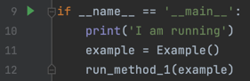
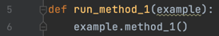
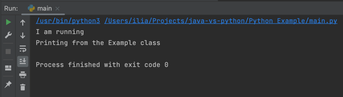
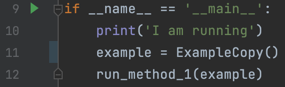
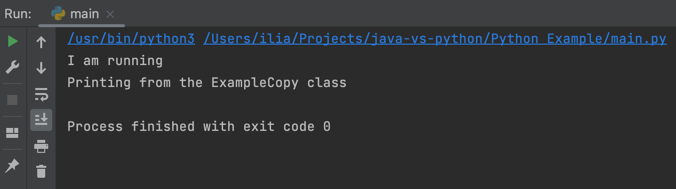
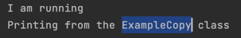
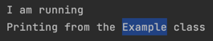
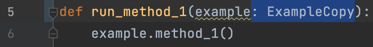
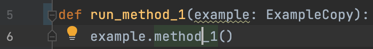

# Steps:

## Python project

### Investigate the Python project

* go to the Python Example directory
* take a look at the Example.py file
  * There's a class Example with a single method method_1() which prints Printing from the Example class
* take a look at the ExampleCopy.py file
  * There's a class ExampleCopy with a single method method_1() which prints Printing from the ExampleCopy class
* so it means that classes Example and ExampleCopy are the same with the only difference - their methods print slightly different things
* take a look at the main.py file
  * 
  * the 9th line is the starting point of the Python program
  * the 10th line we're printing I'm running just to be sure that the program really starts
  * the 11th line we create the object of class Example and call it example
  * the 12th line we pass it to the run_method_1() method. Let's take a look at it
  * 
  * it works simply. It accepts our object and invokes method_1() on that object, which we've seen before

Ok, now you're familiar with the project. You could also run it and get such a result:

### Let's change the type

Go to the main.py file on the 11th line

Change the type of the object example from Example to ExampleCopy. You should get something like that:

And now try to run it:

Make sure you noticed that now it prints ExampleCopy

But not Example, as it used to be

It happened because we changed the type of our object from Example to ExampleCopy. As you remember both classes have 
the same method_1() which print slightly different strings.

Ctrl + B

#### Conclusion

Python doesn't care about our types at all. You can't limit your methods to accept only objects of certain types. 
If it has the method with the same signature - it'll work.

Such a phenomenon is called a duck typing - "If it walks like a duck and it quacks like a duck, then it must be a duck"

### But we can limit the types

Sure, there's such a construction in Python. Let's try it.

Go to the file main.py to the 5th line. Add this thing:

We sort of limited what types the method run_method_1() can accept to ExampleCopy.

And indeed, if you try to click on the method_1() line 6 like this:

And then press the Ctrl+B shortcut, you'll get to the right definition:

