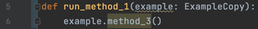

# Steps:

## Python project

### Investigate the Python project

* go to the Python Example directory
* take a look at the Example.py file
  * There's a class Example with a single method method_1() which prints Printing from the Example class
* take a look at the ExampleCopy.py file
  * There's a class ExampleCopy with a single method method_1() which prints Printing from the ExampleCopy class
* so it means that classes Example and ExampleCopy are the same with the only difference - their methods print slightly different things
* take a look at the main.py file
  * 
  * the 9th line is the starting point of the Python program
  * the 10th line we're printing I'm running just to be sure that the program really starts
  * the 11th line we create the object of class Example and call it example
  * the 12th line we pass it to the run_method_1() method. Let's take a look at it
  * 
  * it works simply. It accepts our object and invokes method_1() on that object, which we've seen before

Ok, now you're familiar with the project. You could also run it and get such a result:

### Let's change the type

Go to the main.py file on the 11th line

Change the type of the object example from Example to ExampleCopy. You should get something like that:

And now try to run it:

Make sure you noticed that now it prints ExampleCopy

But not Example, as it used to be

It happened because we changed the type of our object from Example to ExampleCopy. As you remember both classes have 
the same method_1() which print slightly different strings.

Ctrl + B

#### Conclusion

Python doesn't care about our types at all. You can't limit your methods to accept only objects of certain types. 
If it has the method with the same signature - it'll work.

Such a phenomenon is called a duck typing - "If it walks like a duck and it quacks like a duck, then it must be a duck"

### But we can limit the types

Sure, there's such a construction in Python. Let's try it.

Go to the file main.py to the 5th line. Add this thing:

We sort of limited what types the method run_method_1() can accept to ExampleCopy.

And indeed, if you try to click on the method_1() line 6 like this:

And then press the Ctrl+B shortcut, you'll get to the right definition:

That's right. But it doesn't make us to pass object of types exactly ExampleCopy.

Now go back to the 11th line and let's change the type of the object back to Example:

You see, the IDE started complaining

But it doesn't forbid us to pass the object of the "incorrect" type. Let's run it:

You see, it printed the Example's method, not the ExampleCopy's one.

#### Conclusion

Python provides you with such a construction which allows you to point the target type, 
but it doesn't force you to pass the correct one.

Is it bad? I would say it depends. But we're all humans, and we're prone to make mistakes and not to do work which is 
not necessary. You have to force yourself to point the types and check whether everything 
you're passing is correct. So you may miss this "unnecessary" part several times,
which could lead you to bugs.

### We can go even further

If Python doesn't care about our types at all and it's not type safe, maybe there's a
chance that it at least could stop us from invoking what we can't invoke? Like non-existing methods.

Let's find out.

Go to the 6th line and change the method you invoke on the object to method_3(), for example:

Notice that the IDE is complaining about the absence of the method:

But that's only a warning which won't stop us from running it. Let's run it:

Read it carefully. I want you to understand that it not just failed. It started and only then it failed.
You see, there's the "I'm running" line which is printed in the very beginning of the program.

By the way, if we remove that type from the 5th line, the IDE will stop complaining:

#### Conclusion

That's a small example, but extrapolate it on a large program, remember that there're "if" and "switch-case" 
constructions, the way your program will be executed depends on several factors. So you can't check whether you're 
doing something legal or illegal with just starting your program.

Imagine the situation when your program is used by your customer and their clients and then it runs into such a bug, 
fails and stops working. Your client is angry, you need to fix it as soon as possible, but you remember that the 
program is quite big, right? So it'll be a challenge to find out what's wrong with it in a short time.

---

That was the example of working with a dynamically typed language like Python. The next one will show you exactly the 
same example, but written in Java.

---

## Java project

### Investigate the Java project

Go to the Java Example directory.

Take a look at the Example.java file.

There's a class Example with a single method method_1() which prints Printing from the Example class

Take a look at the ExampleCopy.py file

There's a class ExampleCopy with a single method method_1() which prints Printing from the ExampleCopy class

So it means that classes Example and ExampleCopy are the same with the only difference - their methods print slightly different things

Take a look at the main.py file

The 9th line is the starting point of the Python program

The 10th line we're printing I'm running just to be sure that the program really starts

The 11th line we create the object of class Example and call it example

The 12th line we pass it to the run_method_1() method. Let's take a look at it

It works simply. It accepts our object and invokes method_1() on that object, which we've seen before

