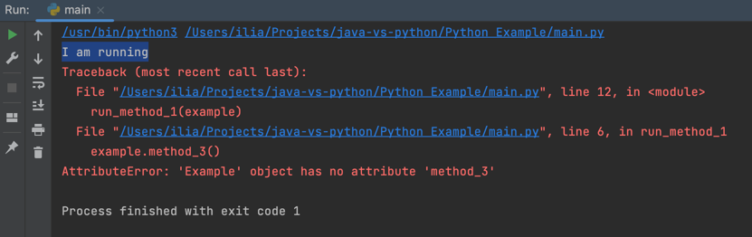
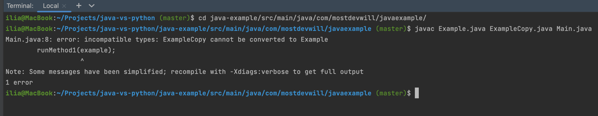

# Steps:

## Before we start

I just wanted to mention that I use IntelliJ IDEA with the Python plugin installed. You may choose any tool you want to 
work with this project.

But I suggest you to try IntelliJ IDEA. It's awesome 🙂

## Python project

### Investigate the Python project

Go to the Python Example directory.

Take a look at the Example.py file.

There's a class Example with a single method "method_1()" which prints Printing from the Example class.

Take a look at the ExampleCopy.py file.
There's a class ExampleCopy with a single method "method_1()" which prints Printing from the ExampleCopy class.

So it means that classes Example and ExampleCopy are the same with the only difference - their methods print 
slightly different things.

Take a look at the main.py file:


The 9th line is the starting point of the Python program.\
The 10th line we're printing I'm running just to be sure that the program really starts.\
The 11th line we create the object of class Example and call it example.\
The 12th line we pass it to the run_method_1() method. Let's take a look at it.\


It works simply. It accepts our object and invokes method_1() on that object, which we've seen before.

Ok, now you're familiar with the project. You could also run it and get such a result:


### Let's change the type

Go to the main.py file on the 11th line.

Change the type of the object example from Example to ExampleCopy. You should get something like that:


And now try to run it:


Make sure you noticed that now it prints ExampleCopy:


But not Example, as it used to be:


It happened because we changed the type of our object from Example to ExampleCopy. As you remember both classes have 
the same method_1() which print slightly different strings.

#### Shortcut

And by the way, if you set the cursor on the method like this:


And then press Ctrl+B shortcut to go to the definition of the method, the IDE won't be able to find the right one:


You see, both classes have methods with the same name.

#### Conclusion

Python doesn't care about our types at all. You can't limit your methods to accept only objects of certain types. 
If it has the method with the same signature - it'll work.

Such a phenomenon is called a duck typing - "If it walks like a duck, and it quacks like a duck, then it must be a duck".

### But we can limit the types

Sure, there's such a construction in Python. Let's try it.

Go to the file main.py to the 5th line. Add this thing:


We sort of limited what types the method run_method_1() can accept to ExampleCopy.

And indeed, if you try to click on the method_1() line 6 like this:


And then press the Ctrl+B shortcut, you'll get to the right definition:


That's right. But it doesn't make us to pass object of types exactly ExampleCopy.

Now go back to the 11th line and let's change the type of the object back to Example:


You see, the IDE started complaining:


But it doesn't forbid us to pass the object of the "incorrect" type. Let's run it:


You see, it printed the Example's method, not the ExampleCopy's one.

#### Conclusion

Python provides you with such a construction which allows you to point the target type, 
but it doesn't force you to pass the correct one.

Is it bad? I would say it depends. But we're all humans, and we're prone to make mistakes and not to do work which is 
not necessary. You have to force yourself to point the types and check whether everything 
you're passing is correct. So you may miss this "unnecessary" part several times,
which could lead you to bugs.

### We can go even further

If Python doesn't care about our types at all, and it's not type safe, maybe there's a
chance that it at least could stop us from invoking what we can't invoke? Like non-existing methods.

Let's find out.

Go to the 6th line and change the method you invoke on the object to method_3(), for example:


Notice that the IDE is complaining about the absence of the method:


But that's only a warning which won't stop us from running it. Let's run it:



Read it carefully. I want you to understand that it not just failed. It started and only then it failed.
You see, there's the "I'm running" line which is printed in the very beginning of the program.

By the way, if we remove that type from the 5th line, the IDE will stop complaining:


#### Conclusion

That's a small example, but extrapolate it on a large program, remember that there are "if" and "switch-case" 
constructions, the way your program will be executed depends on several factors. So you can't check whether you're 
doing something legal or illegal with just starting your program.

Imagine the situation when your program is used by your customer and their clients, and then it runs into such a bug, 
fails and stops working. Your client is angry, you need to fix it as soon as possible, but you remember that the 
program is quite big, right? So it'll be a challenge to find out what's wrong with it in a short time.

---

That was the example of working with a dynamically typed language like Python. The next one will show you exactly the 
same example, but written in Java.

---

## Java project

### Investigate the Java project

Go to the Java Example directory.

Take a look at the Example.java ExampleCopy.java files.

Make sure that you noticed, that those java files do exactly the same things as its python analogues.

Take a look at the Main.java file:


It's the same too. Method main is the starting point of the program.

Let's try to run it:


You see, exactly the same output.

### Let's change the type

Alright, let's try to perform the same trick with changing the type as we've done already in the previous project.

Go to the file Main.java line 7 and change the type of the object to ExampleCopy:


If you're attentive enough, you should notice that something's wrong with the 8th line:


The IDE says to us that we should've passed an object of class Example, but not Example copy.

But maybe that's just another warning which can't stop us from running it? Let's find out.

If you try to run it, you'll get the same message:


Have you noticed that it hasn't printed the line "I'm running"? Of course, it hasn't, because it hasn't started.
But what's this error about then?

Actually, running it you first initialized the process of generating .class files from your .java ones, 
which then could be executed.

If you're not familiar with it, watch my short videos about that:

You may call it a compilation error (even though the term is not correct).

Let's try to perform this "compilation" by ourselves.

Open the terminal. I use the one which is integrated to the IDE. You can find it in the bottom:


And type this command:

```shell
cd java-example/src/main/java/com/mostdevwill/javaexample/
javac Example.java ExampleCopy.java Main.java

```
And now read the error:



It's the same as we've got in the IDE, isn't it?

## Homework

1. Make the java project workable again.
2. Try to invoke a non-existing method in the method runMethod1() in the Main.java file.
3. Run it. Look at the error.
4. Run javac manually. Compare errors.

# Conclusion

Don't get me wrong. I don't hate Python, I don't think that Java is the best language in the world or that every single 
one should use Java in there work and nothing else.

I just talk to lots of people and I know that guys who just started their journey in the programming niche, 
don't know the difference between languages, which one they should use and which shouldn't.

Every single language has its own niche. If you like backend development, big systems and so on, I hope that now you 
understand why Python is not a good choice.

On the other hand, if you need to create some small script, or you want to learn Data Science, Machine Learning and so 
on, in that case you should use Python, because it's a standard for that industry (as far as I know). Why?

Because the scope is smaller, you may stop carrying about types and write the program faster. Even if you have some 
bugs, you'll find it quite fast.

Love Java, love Python and choose technologies wisely.

# About me

I'm Will, a Java Developer with 4+ years of experience. Currently, I work in Epam and develop my blog a little.

My main platform is [Instagram](https://www.instagram.com/mostdevwill/). If you want to know more about me and be 
notified about everything I'm doing for my blog, follow me on Instagram.

I also have [TikTok](https://www.tiktok.com/@mostdevwill) and [YouTube](https://www.youtube.com/@mostdevwill) where 
I duplicate short videos from Instagram.

And hit this repository on GitHub 🙂

---

Thanks for reading this guide. Wish you luck on your way.

If you have question, feel free to write to me on Instagram.

Best regards,\
Will


